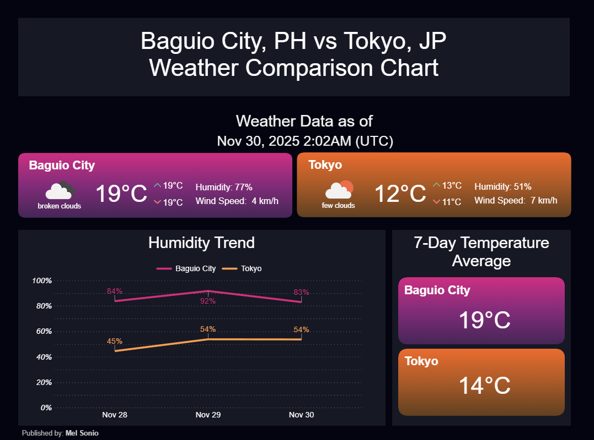
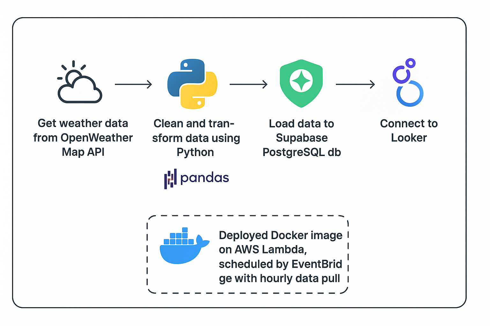

# Real-Time Weather Data Pipeline

## Description: 
Automated pipeline that collects, cleans, stores, and visualizes live weather data of Baguio City, PH and Tokyo, JP
[](https://lookerstudio.google.com/reporting/d4d8afde-7e2e-4157-91bb-49f08894017b)

## Architecture Overview
- Data pulled hourly from OpenWeatherMap
- Python ETL runs inside a Lambda function (Dockerized) and fires hourly using Eventbridge rule
- Data stored in Supabase PostgreSQL
- Visualization updated hourly in Looker Studio


## Database Schema
- `id`: type: int2, unique record identifier, auto-incrementing
- `created-at`: type: timestampz (timestamp with timezone), timestamp of data pull
- `city`: type: varchar, either Baguio City or Tokyo
- `weather`: type: varchar, weather condition
- `temperature`: type: int2, Celsius
- `temperature_min`: type: int2, Celsius
- `temperature_max`: type: int2, Celsius
- `humidity`: type: int2, %
- `wind_speed`: type: int2, km/h
- `icon_id`: type: int2, weather icon id


## Tech Stack
- Python
- Pandas
- Supabase Postgres
- Docker
- AWS Lambda
- Eventbridge
- Looker Studio

## Folder Structure
```text
/project-root
│
├── main.py                     # Entry point with Lambda handler
├── utils/                      # Helper functions and class methods
│   ├── db_server.py            # Class + methods for database interactions
│   ├── openweathermap_server.py# Class + methods for sending API requests
│   └── helpers.py              # General helper functions (metric conversions, sql query generator, etc.)
│
├── requirements.txt            # Python dependencies
├── Dockerfile                  # Builds AWS Lambda container image
└── .gitignore                  # Contains ignored files

```

## Environment Variables
- `API_KEY`: API key for getting weather data from OpenWeatherMap
- `DB_URI`: Connection string for connecting and querying to the Supabase Postgres database
- `DB_TABLE1`: Name of the database table containing the weather data

## Local Setup Instructions
```
# Clone the repo
git clone https://github.com/melgasonio/weather_data_pipeline
cd weather_data_pipeline

# Create a virtual environment
python3 -m venv myenv
# Activate
source venv/bin/activate   # Windows: venv\Scripts\activate

# Install required dependencies
pip install -r requirements.txt

# Run locally without Docker
python3 main.py
```

## Deployment Instructions

Requirements:

- [AWS CLI](https://docs.aws.amazon.com/cli/latest/userguide/getting-started-install.html)
- [Docker](https://www.docker.com/products/docker-desktop/)

```
# PowerShell

# Check if AWS CLI exists:
aws --version

# If not installed, follow AWS’s setup guide, then configure:
aws configure

# ----------------------------------------------------------
# Enter your:
#   - AWS Access Key ID
#   - AWS Secret Access Key
#   - Default region
#   - Output format
#
# Once the AWS CLI is installed, every command below will run
# in PowerShell without modification.
# ----------------------------------------------------------

# Authenticate Docker to AWS ECR
aws ecr get-login-password --region <AWS_REGION> |
  docker login --username AWS --password-stdin <AWS_ACCOUNT_ID>.dkr.ecr.<AWS_REGION>.amazonaws.com

# Build the Docker image
docker build -t <IMAGE_NAME> .

# Tag the Docker image for ECR
docker tag <IMAGE_NAME>:latest `
  <AWS_ACCOUNT_ID>.dkr.ecr.<AWS_REGION>.amazonaws.com/<REPO_NAME>:latest

# Push the image to ECR
docker push `
  <AWS_ACCOUNT_ID>.dkr.ecr.<AWS_REGION>.amazonaws.com/<REPO_NAME>:latest

# Create new Lambda function
aws lambda create-function `
  --function-name <LAMBDA_FUNCTION_NAME> `
  --package-type Image `
  --code ImageUri=<AWS_ACCOUNT_ID>.dkr.ecr.<AWS_REGION>.amazonaws.com/<REPO_NAME>:latest `
  --role <LAMBDA_EXECUTION_ROLE_ARN> `
  --memory-size 512 `
  --timeout 300

# Or update existing
aws lambda update-function-code `
  --function-name <LAMBDA_FUNCTION_NAME> `
  --image-uri <AWS_ACCOUNT_ID>.dkr.ecr.<AWS_REGION>.amazonaws.com/<REPO_NAME>:latest

# Set environment variables
aws lambda update-function-configuration `
  --function-name <LAMBDA_FUNCTION_NAME> `
  --environment "Variables={
      API_KEY=<YOUR_API_KEY>,
      DBI_URI=<YOUR_SUPABASE_URL>,
      DB_TABLE1=<YOUR_TABLE_NAME>
  }"

# Create the hourly EventBridge rule
aws events put-rule `
  --name <RULE_NAME> `
  --schedule-expression "rate(1 hour)"

# Allow EventBridge to invoke Lambda
aws lambda add-permission `
  --function-name <LAMBDA_FUNCTION_NAME> `
  --statement-id "<STATEMENT_ID>" `
  --action "lambda:InvokeFunction" `
  --principal events.amazonaws.com `
  --source-arn arn:aws:events:<AWS_REGION>:<AWS_ACCOUNT_ID>:rule/<RULE_NAME>

# Attach Lambda as the EventBridge target
aws events put-targets `
  --rule <RULE_NAME> `
  --targets "Id"="<TARGET_ID>","Arn"="<LAMBDA_ARN>"

# Verify deployment logs
aws logs tail /aws/lambda/<LAMBDA_FUNCTION_NAME> --follow
```

